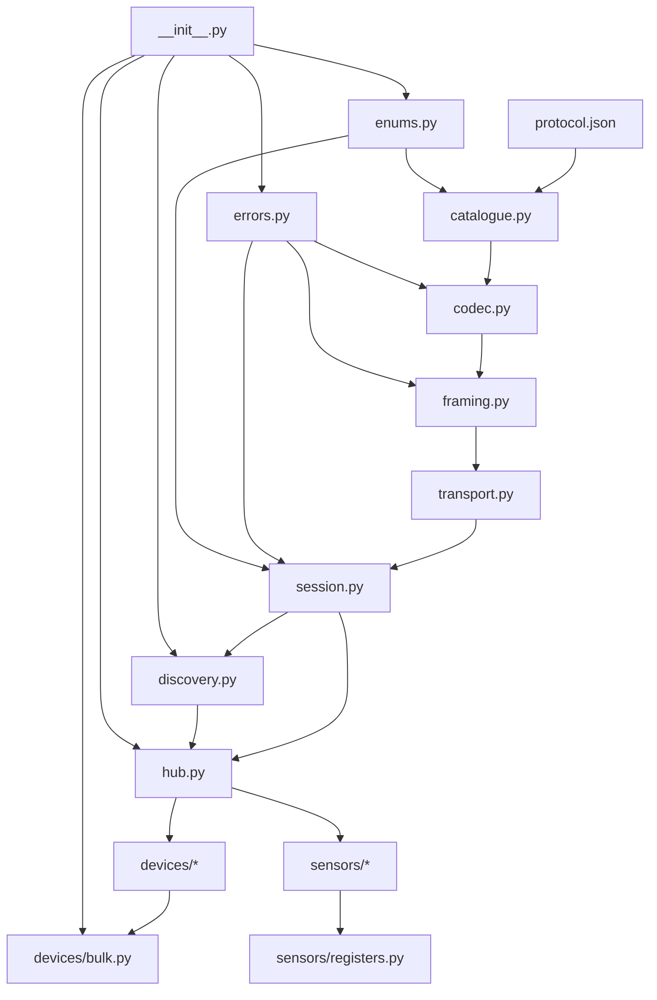
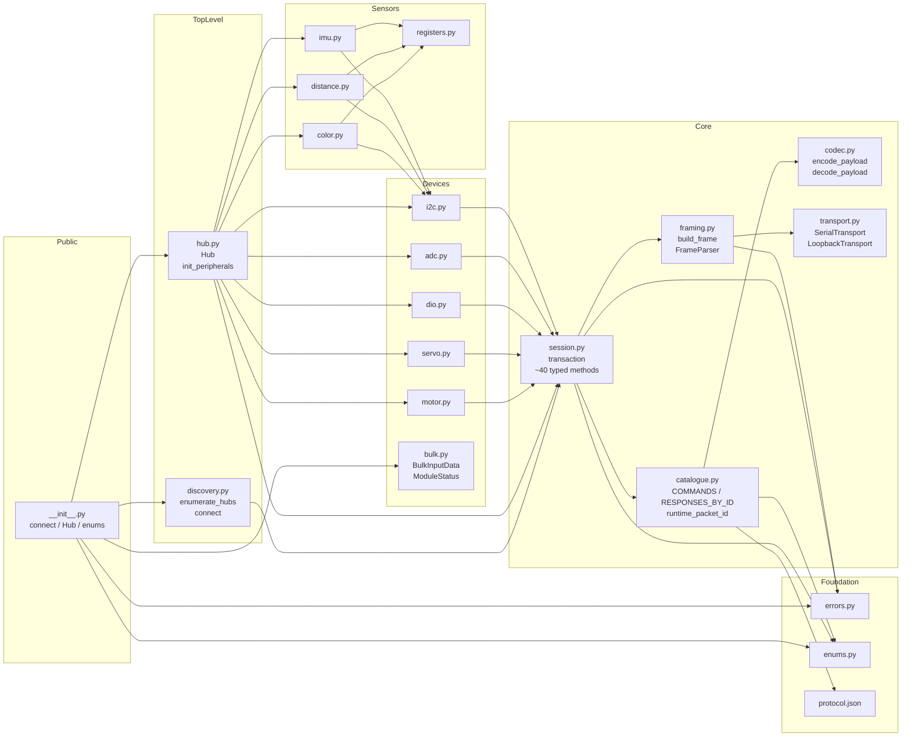
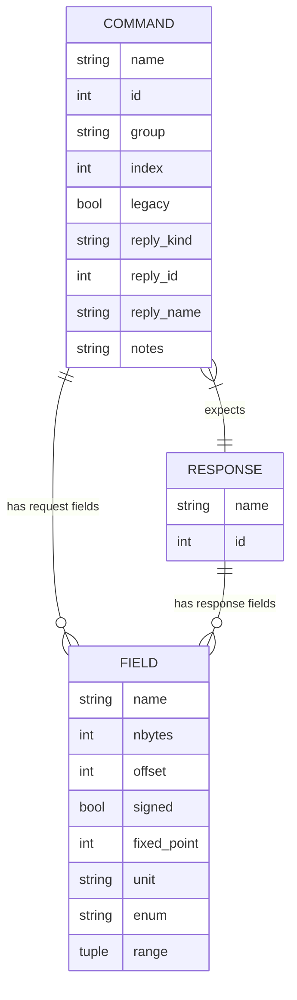

# Architecture Update — Sprint 001: Build new idiomatic rhsp library

## What Changed

This sprint introduces the entire `src/rhsp/` package as a ground-up replacement
for `vendor/rhsp/`. No modules from the vendor package are reused; the vendor
package is preserved as reference only. The new package comprises nine core
modules, two sub-packages (devices, sensors), and a packaged runtime data file.

**Added modules:**

| Module | Purpose |
|--------|---------|
| `src/rhsp/protocol.json` | Packaged copy of `docs/rhsp-protocol.json`; the single runtime data source |
| `src/rhsp/errors.py` | Exception hierarchy: `RhspError`, `ProtocolError`, `ChecksumError`, `RhspTimeoutError`, `NackError` |
| `src/rhsp/enums.py` | `IntEnum`/`IntFlag` types generated from the JSON `enums` section |
| `src/rhsp/codec.py` | `Field`, `Command`, `Response` frozen dataclasses; `encode_payload`/`decode_payload` |
| `src/rhsp/catalogue.py` | Loads `protocol.json` → `COMMANDS`, `RESPONSES_BY_ID`; legacy tagging; `runtime_packet_id()` |
| `src/rhsp/framing.py` | `FRAME`, `HEADER` struct, `checksum`, `build_frame`, `FrameParser`, `RawPacket` |
| `src/rhsp/transport.py` | `Transport` Protocol; `SerialTransport` (pyserial); `LoopbackTransport` |
| `src/rhsp/session.py` | `Session`: `transaction()` + ~40 typed methods + msg_num sequencing + validation |
| `src/rhsp/discovery.py` | `enumerate_hubs()`, `connect()`, drained `discover()`, `QueryInterface` base |
| `src/rhsp/hub.py` | `Hub`: single address, `init_peripherals()` with rollback, explicit `keep_alive()` |
| `src/rhsp/__init__.py` | Public re-exports: `connect`, `Hub`, `enumerate_hubs`, errors, enums, bulk dataclasses |
| `src/rhsp/py.typed` | PEP 561 marker |
| `src/rhsp/devices/motor.py` | `Motor` (channels 0–3): typed wrappers for motor commands |
| `src/rhsp/devices/servo.py` | `Servo` (channels 0–5): typed wrappers for servo commands |
| `src/rhsp/devices/dio.py` | `DIOPin` (pins 0–7): direction, read, write |
| `src/rhsp/devices/adc.py` | `ADCPin` (channels 0–3): read |
| `src/rhsp/devices/i2c.py` | `I2CChannel`, `I2CDevice`: write/read with NACK-41 poll loop |
| `src/rhsp/devices/bulk.py` | `BulkInputData`, `ModuleStatus`: decoded from `GetBulkInputData` |
| `src/rhsp/sensors/registers.py` | Register constants for APDS-9960, VL53L0X (incl. `OSC_CALIBRATE_VAL=0xF8`), BNO055 |
| `src/rhsp/sensors/color.py` | `ColorSensor` / `ColorSensorV3` (APDS-9960) |
| `src/rhsp/sensors/distance.py` | `Distance2m` (VL53L0X) |
| `src/rhsp/sensors/imu.py` | `IMU` (BNO055) |

**Added test infrastructure:**

| File | Purpose |
|------|---------|
| `tests/fakehub.py` | `FakeHub`: `LoopbackTransport`-backed simulator; answers KeepAlive, Discovery, QueryInterface, configurable NACK |
| `tests/test_framing.py` | Golden vector assertions; `FrameParser` round-trips; `ChecksumError` |
| `tests/test_codec.py` | Codec round-trips for every JSON entry; signed/Q16/variable-length |
| `tests/test_session.py` | msg_num sequencing; ref_num correlation; NACK/timeout; discovery |
| `tests/test_devices.py` | Byte-exact payload assertions; P7 bug regression suite |
| `tests/test_sensors.py` | Recorded I2C register-sequence assertions vs. §2.14 recipes |

**Added examples:**

- `examples/` — rewritten `test/` scripts; skip via `pytest.skip()` when no hub enumerated.

**Removed from `src/rhsp/`:**

- `__main__.py` (dead tkinter GUI — deleted).

**Modified:**

- `pyproject.toml` — packaging source flipped from `vendor/rhsp` to `src/rhsp`; `uv sync` run.
- `docs/generate_protocol_json.py` — inverted to introspect `catalogue.py` (JSON is now
  source, generator is now validator).

---

## Why

The `vendor/rhsp/` package was decompiled from a compiled artifact and has
critical structural and protocol-alignment problems that cannot be fixed
incrementally:

- **Architecture**: 224 near-identical hand-maintained message classes; a dead
  two-layer internal split; hex-ASCII string wire format through metaclass
  metaprogramming; `exit()` for error handling; dead tkinter GUI in the package.
- **Protocol violations**: Hard-coded DEKA base 0x1000 (must be dynamic via
  `QueryInterface`); `msg_num=0` on first send (spec requires ≥1); 128-byte receive
  buffer (spec is 512); no response type or `ref_num` validation; NACK swallowed
  (must raise `NackError`); command map diverges from stock firmware at index 0x31+.
- **Concrete bugs (P7)**: `DIOPin.get_direction` never returns; I2C configure drops
  session arg; block-read config sets message attrs not payload fields; PID setter
  calls getter; `I2CConfigureQuery_RSP` missing from dispatch table;
  `OSC_CALIBRATE_VAL` undefined; `GetPWMPulseWidth` response width wrong.

The ground-up rewrite addresses all three categories simultaneously. The key
enabling decision is the runtime data-table codec seeded from `protocol.json`:
72 JSON rows replace 224 hand-written classes, and protocol changes require only
a data update.

---

## Module Architecture

### Dependency Graph



Data flows strictly upward: `protocol.json` → codec → framing → transport →
session → discovery/hub → devices/sensors. No downward dependencies. `errors.py`
and `enums.py` are leaves that everything else can import without creating cycles.

### Component Diagram



### Module Boundaries and Responsibilities

**`errors.py`** — Exception hierarchy. Responsibility: define all typed
exceptions. Boundary: no imports from any other `rhsp` module; imported by
everything else. Use cases: UC-016, all error flows.

**`enums.py`** — Integer enum types derived from the JSON `enums` section.
Responsibility: provide typed constants for motor modes, NACK codes, status
bits, etc. Boundary: no runtime hub interaction. Use cases: UC-004–UC-011.

**`protocol.json`** (data file) — The machine-readable command/response
catalogue. Responsibility: single source of truth for all field layouts, offsets,
types, and enumeration values. Boundary: read-only at import time by `catalogue.py`
via `importlib.resources`; no other module reads it directly.

**`codec.py`** — Field/Command/Response frozen dataclasses and the two generic
encode/decode functions. Responsibility: binary serialization and deserialization
of payload bytes from/to typed Python dicts, using only the field descriptors
passed in. Boundary: no JSON reads, no catalogue imports, no hub awareness.
Use cases: SUC-001.

**`catalogue.py`** — Loads `protocol.json` and builds `COMMANDS` and
`RESPONSES_BY_ID` lookup tables. Applies the JSON overlay (signed, fixed_point,
enum, range) when constructing `Field` instances. Tags legacy commands.
Exposes `runtime_packet_id()`. Responsibility: map command names to typed
descriptors and resolve packet ids at runtime. Boundary: reads JSON only at
module import; downstream modules query tables, never read JSON.
Use cases: SUC-003, UC-022.

**`framing.py`** — Packet serialization. Responsibility: assemble and parse
the 10-byte RHSP header + payload + checksum; validate checksums; provide a
streaming `FrameParser` that handles partial reads and resyncs on the `DK` magic
bytes. Boundary: knows byte layout only; unaware of command semantics.
Use cases: SUC-002, UC-023.

**`transport.py`** — I/O interface. Responsibility: move raw bytes over the serial
port (`SerialTransport`) or in-memory (`LoopbackTransport`). Boundary: no protocol
awareness; operates on raw `bytes` only. Use cases: SUC-004 (testing), UC-001.

**`session.py`** — Transaction engine. Responsibility: maintain `_msg_num`
(1..255, never 0), build and send frames, receive and validate responses (type
match + `ref_num` correlation), retry on timeout/checksum, raise `NackError` on
NACK, expose ~40 typed snake_case methods for all DEKA 0x00–0x30 commands and
system commands. Boundary: speaks only to `Transport`; knows about codec and
catalogue but not about `Hub` or device objects. Use cases: UC-001–UC-022.

**`discovery.py`** — Hub enumeration and connection. Responsibility:
`enumerate_hubs()` scans USB serial ports for `D`-prefix serial numbers;
`connect()` opens transport + session + drained discovery + `QueryInterface`
to obtain `deka_base`. `discover()` uses a quiet-window drain, not a fixed
`time.sleep`. Boundary: returns `Hub` objects; does not configure peripherals.
Use cases: UC-001, UC-002, UC-003.

**`hub.py`** — Hub object. Responsibility: represent a single hub address,
own its peripheral device objects (4 motors, 6 servos, 8 DIO, 4 ADC, 4 I2C),
run `init_peripherals()` with `fail_safe()` rollback, expose explicit
`keep_alive()`. Boundary: no `module`+`destinationModule` duplication; single
`address` field. Use cases: UC-001, UC-004–UC-021.

**`devices/bulk.py`** — Bulk input dataclass. Responsibility: decode the
`GetBulkInputData` response into a named `BulkInputData` dataclass with correct
signed-32 encoder and signed-16 velocity fields. Handles the vendor typo
`mototonicTime`. `ModuleStatus` decodes the two-byte status reply.
Use cases: UC-005, UC-015.

**`devices/motor.py`**, **`servo.py`**, **`dio.py`**, **`adc.py`**,
**`i2c.py`** — Thin typed wrappers that call `session.<method>` and hold the
device's channel/pin/address. `I2CDevice` implements the two-phase read +
NACK-41 poll loop. No `internal/` passthrough layer. Use cases:
UC-004–UC-011.

**`sensors/registers.py`** — Register address constants for APDS-9960,
VL53L0X (including `OSC_CALIBRATE_VAL = 0xF8`), and BNO055. No hub interaction.
Use cases: UC-012, UC-013, UC-014.

**`sensors/color.py`**, **`distance.py`**, **`imu.py`** — Sensor drivers
layered on `I2CDevice`. Each runs the §2.14 bring-up sequence using
`write_register`/`read_register` calls. Use cases: UC-012, UC-013, UC-014.

**`__init__.py`** — Public API surface. Re-exports: `connect`, `Hub`,
`enumerate_hubs`, all error classes, all enum types, `BulkInputData`,
`ModuleStatus`. Use cases: UC-023, UC-024.

---

## Data Flow

```
Robot developer
      │
      ▼
 connect() ──► enumerate_hubs() ──► SerialTransport
      │                                    │
      ▼                                    ▼
  Session ◄───────────────────────── FrameParser
      │                                    │
      ├── catalogue.COMMANDS               │
      ├── codec.encode_payload ────────────►  bytes on wire
      └── codec.decode_payload ◄───────────  bytes from hub
      │
      ▼
   Hub (address, motors, servos, ...)
      │
      ├── Motor.set_power(p) ──► session.set_motor_constant_power(addr, ch, p)
      ├── Servo.set_pulse_width(pw) ──► session.set_servo_pulse_width(addr, ch, pw)
      ├── DIOPin.read() ──► session.get_single_dio_input(addr, pin)
      ├── I2CChannel.device(addr) ──► I2CDevice
      │       └── .read_register(reg, n) ──► I2CReadMultipleBytes + poll
      └── sensors: ColorSensor / Distance2m / IMU
              └── layered on I2CDevice.write_register / read_register
```

---

## Entity-Relationship: Command Catalogue Data Model



---

## Design Rationale

### Decision 1: Runtime data-table codec, not code generation

**Context**: 72 commands × 2 (request/response) = ~144 payload shapes. The
vendor package handled this with ~224 near-identical hand-written classes.

**Alternatives considered**:
- Code generation from JSON → Python source (avoids runtime JSON parse, but
  creates a two-file maintenance burden and a build step).
- Keep the vendor class explosion (no, it was the original problem).
- Runtime codec (chosen).

**Why this choice**: A single `encode_payload(fields, values)` /
`decode_payload(fields, data)` pair driven by `Field` descriptors handles all
72 commands without any per-command code. Adding or changing a command requires
only a JSON edit. The `importlib.resources` load is O(ms) at import time — not
a performance concern for a serial-rate library.

**Consequences**: All codec correctness is concentrated in two functions plus
the JSON data. Test coverage of those functions over the full JSON corpus is
sufficient; no per-command test needed.

---

### Decision 2: Typed session methods (~40) plus generic `transaction()` escape hatch

**Context**: Device API needs type safety and discoverability; raw access is
needed for advanced use cases (legacy high-id commands, one-off protocol frames).

**Alternatives considered**:
- Pure generic `transaction()` only: no IDE completion, no type safety.
- One typed method per command (72 stubs): re-introduces class explosion.
- Hybrid (chosen).

**Why this choice**: The ~40 methods cover all DEKA 0x00–0x30 commands and
system commands used by the device API. `transaction()` covers the rest without
requiring typed wrappers for commands that may not be supported on all firmware
versions.

**Consequences**: Any new firmware command is immediately accessible via
`transaction()` without a library change. Adding a typed method is additive.

---

### Decision 3: Synchronous, no background threads

**Context**: The RHSP protocol is strictly half-duplex with one outstanding
transaction at a time. The vendor code imported `multiprocessing.Queue` and
`tkinter` but never used them; there was no thread safety.

**Alternatives considered**:
- `asyncio`-based transport: cleaner for the event-loop model, but forces
  async on all callers.
- Background keep-alive thread: convenient, but requires locking the serial port
  and complicates session lifecycle.
- Explicit keep-alive (chosen).

**Why this choice**: Synchronous blocking I/O matches the protocol's half-duplex
nature exactly. Explicit `hub.keep_alive()` is simpler, safer, and avoids
threading bugs. The library's docstring on `keep_alive()` is sufficient to
communicate the 2500 ms requirement to callers.

**Consequences**: Callers must implement their own keep-alive loop. This is
intentional — the library does not assume the caller's event model.

---

### Decision 4: Stock-firmware command map canonical for ≥ 0x31; legacy commands behind `transaction()`

**Context**: The vendor Python package and REV stock firmware assign different
commands to DEKA indices ≥ 0x31. Using either set of high-id typed methods
would break on firmware that uses the other map.

**Alternatives considered**:
- Expose typed methods for both maps under different names: doubles the surface
  area; confusing.
- Expose only stock-firmware high-id methods: breaks users of vendor-only commands.
- Tag legacy and expose only via `transaction()` (chosen).

**Why this choice**: The only safe typed methods are those at indices 0x00–0x30
(universally agreed). High-id commands are firmware-dependent and must be opt-in.
`GetBulkInputData` (0x00) provides all the bulk data typed methods need
(encoder, velocity, ADC, servo) without touching the divergent range.

**Consequences**: `Motor.get_velocity` reads `GetBulkInputData` (0x00), not the
legacy `GetBulkMotorData` (0x37). Callers needing high-id stock-firmware commands
use `session.transaction("I2C_TRANSACTION", ...)` or similar.

---

## Open Questions

1. **`QueryInterface` string padding**: Should `interfaceName` be sent as
   raw `b"DEKA\x00"` or zero-padded to the 121-byte field maximum? A per-field
   `pad` switch in the codec would handle both. Needs hardware confirmation.

2. **I2CReadStatusQuery poll budget**: NACK-41 ("operation in progress — poll
   again") requires a retry loop. Default of 5 polls × 1 ms is a reasonable
   starting point, but actual sensor timing on a real hub is unknown. This is
   non-blocking for implementation; the constant can be tuned without an API
   change.

3. **`BulkInputData` signed fields**: The JSON RSP overlay currently omits the
   `signed` flag for encoder/velocity fields. `bulk.py` reinterprets them as
   signed by construction. The JSON overlay should be corrected for consistency
   with the inverted generator. Ticket 015 (generator inversion) surfaces this
   drift.

4. **Stock-firmware high-id commands** (PIDF, I2C_TRANSACTION, binary
   READ_VERSION, SET_BULK_OUTPUT_DATA): These are in `protocol.json` with
   `group="deka"` and `index >= 0x31`. They are tagged `legacy=True` in the
   catalogue. No typed methods are defined; they are accessible via
   `transaction()`. Typed methods should be added only after hardware validation.

---

## Impact on Existing Components

- **`vendor/rhsp/`**: No changes. Stays as-is; `pyproject.toml` temporarily
  installs it until Ticket 014 flips the packaging source.
- **`test/`**: The existing `test/` scripts (hardware-only) are rewritten as
  `examples/` in Ticket 013. They use the new snake_case API.
- **`docs/generate_protocol_json.py`**: Inverted in Ticket 015. Before that
  ticket, the generator script continues to reflect the old implementation.
- **`pyproject.toml`**: Modified only in Ticket 014. Until then it installs
  `vendor/rhsp`.

---

## Migration Concerns

The new `src/rhsp/` API is a **breaking change**. All names are snake_case;
camelCase names are gone. The vendor package remains importable at its current
install path until Ticket 014. After Ticket 014, `import rhsp` resolves to
`src/rhsp/`. The `test/` scripts (which used camelCase) are replaced by
`examples/` using the new API. No production users are known beyond the FTC
robotics development context; the breaking change is intentional and documented
in the README update (Ticket 013).
