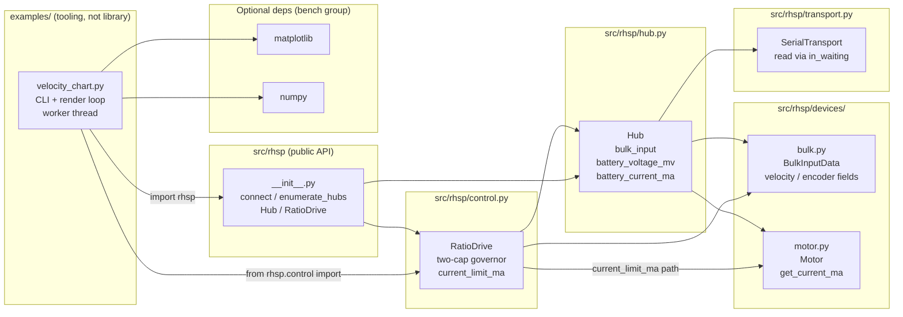
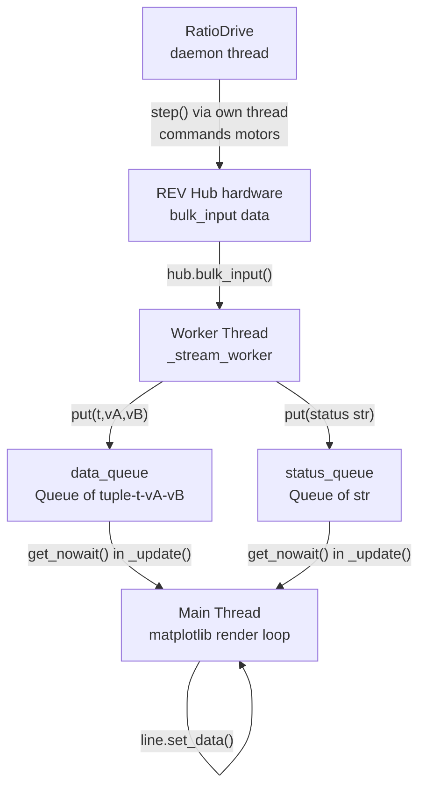

<!-- CLASI: Before changing code or making plans, review the SE process in CLAUDE.md -->

# Architecture Update -- Sprint 003: velocity_chart bench tool

## What Changed

### New file: `examples/velocity_chart.py`

An interactive bench tool in the `examples/` directory (no `test_` prefix so
pytest does not collect it). It consumes the public RHSP API and adds no new
library modules.

**Responsibilities**:
- Render three matplotlib panels: strip chart (motor A velocity vs. time), strip
  chart (motor B velocity vs. time), and phase plot (motor-A velocity vs. motor-B
  velocity).
- Accept CLI arguments: `--port`, `--channels`, `--ratio`, `--speed`, `--window`,
  `--vmax`, `--rate`.
- Manage a single daemon worker thread per SPACE-start that opens a fresh hub
  connection, starts `RatioDrive`, and polls `hub.bulk_input()` at the configured
  rate.
- Push `(t, vA, vB)` tuples to a `data_queue` and status strings to a
  `status_queue` for consumption on the main thread.
- Run the matplotlib render loop (~30 fps) on the main thread: drain queues,
  update line artists, draw.
- Handle SPACE (toggle worker) and Q (quit, clean shutdown) via
  `fig.canvas.mpl_connect("key_press_event", ...)`.
- Select the macOS (`MacOSX`) or Linux (`TkAgg`) backend before importing
  `matplotlib.pyplot`.

**Key design choices**:
- Measured velocities come directly from `hub.bulk_input()` in the worker thread
  — not from `RatioDrive`'s internal state — so the chart is ground-truth telemetry.
- `RatioDrive` is used only to drive the motors; it is the single isolated
  integration point.
- Fresh-connection-per-SPACE (matching the reference pattern) makes the tool
  resilient to hub reboots and encoder wedge states.
- The `RatioDrive` context manager (`with RatioDrive(...) as drive:`) guarantees
  motors are zeroed and disabled on any exit path (normal, exception, or
  SPACE-stop).

### Modified: `pyproject.toml`

Adds an optional dependency group:

```toml
[project.optional-dependencies]
bench = ["matplotlib>=3.8", "numpy>=1.26"]
```

This keeps the core library dependency (`pyserial` only) unchanged. The bench
tool is run via `uv run --extra bench python examples/velocity_chart.py`.

---

### Modified: `src/rhsp/transport.py` (added in execution — ticket 003-004)

Fixed `SerialTransport.read` latency. On macOS, pyserial's `inter_byte_timeout`
does not cause `read(512)` to return early — it blocks for the full 1.0 s port
timeout waiting for 512 bytes that never arrive (~20-byte responses). Every
transaction therefore took ~1 000 ms on real hardware (~1 Hz throughput).

**Fix**: When `in_waiting > 0`, read `min(n, in_waiting)` bytes immediately.
When the buffer is empty, do a single blocking `read(1)` (bounded by the
existing `timeout`) so the first byte wakes the caller without busy-waiting. The
session's existing poll loop drains the remainder on subsequent iterations.
Timeout and retry semantics are unchanged; `LoopbackTransport` (tests) is
unaffected. Measured result: ~16 ms/transaction on fw 1.8.2 (~62× speedup).
Three new hardware-free unit tests added in `tests/test_transport.py`.

### Modified: `src/rhsp/control.py` — unified two-cap governor (tickets 003-005, 003-007, 003-009, 003-010)

Tickets 003-005 (spin-up settle timer), 003-007 (current ceiling), and 003-009
(limit-cycle probe) were successive hardware-driven patches that each fixed one
failure mode while introducing a regression in another regime. Ticket 003-010
**superseded all three** by replacing the accumulated patch logic with a single
unified two-cap governor in `RatioDrive.update()`.

**Key hardware insight driving the design**: On fw 1.8.2 the onboard
CONSTANT_VELOCITY PID is stiff — under mechanical load it holds velocity by
ramping motor current toward overcurrent rather than letting speed droop. This
means two physically distinct bottlenecks require the signal that is actually
valid for each:

- **Max-speed bottleneck**: a wheel commanded faster than its physical top speed.
  NOT recoverable until the setpoint or ratio changes. Correct signal: measured
  velocity has **plateaued** (dv/dt ≈ 0) while still below command.
- **Load bottleneck**: a wheel mechanically loaded so motor current spikes.
  Immediately recoverable when load clears. Correct signal: per-motor current.

**Final governor design — two caps per `RatioDrive.update()` tick**:

**Cap 1 — sticky max-speed latch (dv/dt-based)**:
A wheel is "at its ceiling" when its measured velocity is below its commanded
target by `speed_margin_frac` AND `|dv/dt|` (smoothed via EMA, alpha ≈ 0.3) is
below `plateau_threshold_cnts_s2` (default 150 cnt/s²) — meaning it has stopped
accelerating, not merely lagging during spin-up. On detection, latch a per-wheel
cap: `g_max_speed[i] = v_measured_i / |w_i|`. Hold it with no probing — this
eliminates both the limit cycle (009) and the spin-up overshoot (005).

Latch is **hardened** against false fires (003-010 follow-ups): the plateau
condition must persist for `latch_persist_ticks` consecutive ticks (default 3,
60 ms at 50 Hz), AND the would-be cap must be at least `min_latch_frac * g`
(default 0.25) — a near-zero cap value signals spin-up noise, not a genuine
physical ceiling. The `_ever_accelerating` per-wheel flag ensures the plateau
test is only eligible after the motor has first demonstrated meaningful
acceleration, preventing a stopped motor (v=0 since tick 0) from misfiring.

Latch clears on: `set_speed`, `set_speed_rpm`, `set_weights`, or `set_ratio`
calls; or when measured velocity rises above `latch * (1 + speed_margin_frac)`
spontaneously (hysteresis prevents noise-driven false clears).

**Cap 2 — live current cap (opt-in via `current_limit_ma`)**:
When `current_limit_ma` is set, per-motor current is sampled via
`Motor.get_current_ma()` every Nth tick (every 3rd tick at 50 Hz → ~16 Hz
effective, keeping the keep-alive heartbeat within budget). Hysteresis (5%)
guards engage/release transitions. When any motor's current-saturation flag is
active, a proportional ceiling `g * (limit / current)` is applied to `g`. When
ALL motors are under the limit, `live_current_cap = S` — no constraint at all.
This is the critical fix for the 007/009 regression: releasing load causes
current to drop, automatically removing the cap and allowing `g` to recover.

**Slew and g_target computation (each tick)**:
```
sticky_max_speed_cap = min(g_max_speed[i] for latched wheels)  # or S if none latched
live_current_cap     = current-derived ceiling if over-limit, else S
g_target             = min(S, sticky_max_speed_cap, live_current_cap)
```
`g` slews down fast (via `max_accel`, default 6000 cnt/s²) and up fast
(`recovery_accel_up`, defaults to `max_accel`) — spin-up reaches a 1000 cnt/s
setpoint in ~0.4 s at 50 Hz (8 ticks). The live current cap re-engages
automatically if fast recovery draws over-limit current, so no separate
"damped recovery" rate is needed. `g` is clamped to `[min_scale, S]` after slew.

Motor targets are issued as `t_i = clamp_int16(round(g * w_i))` — the commanded
ratio between motors is preserved exactly at all times.

**Superseded parameters** (`sat_settle_s`, `sat_margin`, `sat_release_margin`,
`probe_step`, `probe_settle_ticks`) are accepted but ignored with a deprecation
note. No caller is broken.

**Public API**: `RatioDrive.__init__` call signature is backward-compatible.
New tunables (`ema_alpha`, `plateau_threshold_cnts_s2`, `speed_margin_frac`,
`recovery_accel_up`, `latch_persist_ticks`, `min_latch_frac`) have documented
defaults. `current_limit_ma` API is unchanged from ticket 003-007.

Hardware gate results: ratio-1.0 spin-up reaches 1000 cnt/s with no latch
firing; ratio-5.0 latch fires at the physical ceiling without limit-cycle;
manual load test at `--current-limit 1500` de-rated the pack preserving ratio,
recovered on load release (stakeholder: "the algorithm seems to work really well").

### Modified: `examples/velocity_chart.py` — auto-scaling axes (ticket 003-008)

Fixed `velocity_chart.py` axis scaling. Previously all strip charts and the
phase plot used a single fixed `±vmax` derived only from channel A's `--speed`.
At high ratios (e.g. `--ratio 5.0 --speed 1000`) channel B's trace was entirely
off-screen; the phase plot was degenerate because `set_aspect("equal")` with a
shared range produced a near-flat rectangle.

**Changes** (all confined to `examples/velocity_chart.py`; no library code touched):

- **Strip charts scale per-axis independently**. Each chart's y-limits are
  recomputed on every `_update()` frame via the `_fit_limit()` helper:
  `half_span = max(max(|data_in_window|), |setpoint|, floor=50) * 1.15`.
  Motor A tracks `~speed`; motor B tracks `~speed * ratio`. Hysteresis (5%
  threshold) prevents the axes from "breathing" when data is near-steady.

- **Phase plot drops `set_aspect("equal")`**. X and Y limits are derived
  independently using `_fit_limit()` for each axis. The `y = ratio * x`
  reference line is redrawn each frame spanning the current `xlim`.

- **`--vmax` acts as a cap**, not a fixed limit. It is the ceiling on the
  auto-scaled half-span for both strip charts. When omitted, axes scale freely.

- **`_fit_limit()` helper** (new private function):
  `_fit_limit(values, setpoint, margin=0.15, floor=50.0, vmax_cap=None) -> float`.
  Pure function; no side effects; hardware-free unit tests cover it directly.

Hardware gate passed 2026-06-06: `--ratio 5.0 --speed 1000` kept both strip
charts and the phase plot on-screen throughout the run.

### Modified: `src/rhsp/devices/motor.py` and `src/rhsp/hub.py` — ADC API (ticket 003-006)

On fw 1.8.2 the `GetBulkInputData` response is ~34 bytes — it ends after
encoders/velocities/motor modes. The current and voltage monitor fields in
`BulkInputData` (`motorN_current_ma`, `battery_voltage_mv`, etc.) are not
present in the response; the tolerant decode silently returned 0 for all of them.

**Changes**:
- `Motor.get_current_ma() -> int`: reads via `session.get_adc(addr,
  ADCChannel.ADC_Motor0 + channel)`. Returns mA.
- `Hub.battery_voltage_mv() -> int`: reads via `ADCChannel.ADC_BatteryMonitor`
  (ch 13).
- `Hub.battery_current_ma() -> int`: reads via `ADCChannel.ADC_Battery` (ch 7).
- `src/rhsp/devices/bulk.py`: removed `motor*_current_ma`,
  `battery_current_ma`, `battery_voltage_mv`, `mon5v_mv`, `gpio_current_ma`,
  `i2c_current_ma`, `servo_current_ma` from `BulkInputData`. The class now
  documents that fields beyond offset 34 are zero-padded on fw 1.8.2. Direct
  `session.transaction("GetBulkInputData")` is not supported on fw 1.8.2 and is
  documented as such. `hub.bulk_input()` (which zero-pads short payloads) remains
  the only supported path and continues to return correct encoders/velocities/modes.
14 new hardware-free unit tests added.

---

## Why

**`velocity_chart.py`**: After Sprint 002 landed `RatioDrive`, there is no
interactive way to observe whether the governor actually holds the velocity ratio
under load, or whether the firmware PID converges cleanly to setpoint. A
live-chart bench tool is the standard validation instrument for control loops:
it makes convergence and saturation behavior immediately visible without writing
one-off scripts.

**`bench` optional dependency group**: matplotlib and numpy are large and not
needed for the core library or its test suite. Placing them in an optional group
keeps `uv run pytest` fast and avoids bloating installs for library consumers.
Using `[project.optional-dependencies]` (PEP 508) is the idiomatic uv/pip
pattern and integrates with `uv run --extra`.

**Library fixes (003-004 – 003-007)**: Hardware validation revealed three
blocking defects that could not be deferred:
- `SerialTransport.read` latency made every transaction ~1 000 ms on macOS,
  rendering the bench tool unusable at any practical poll rate.
- The `RatioDrive` governor collapsed to 0 on spin-up due to missing settling
  time on the saturation detector, so motors never reached setpoint.
- `GetBulkInputData` current/voltage fields are silently zero on fw 1.8.2; the
  only way to read motor current is `GetADC`.

**Key hardware insight driving the current-aware design**: The fw 1.8.2 onboard
CONSTANT_VELOCITY PID is stiff — under mechanical load it holds velocity by
ramping motor current toward overcurrent rather than letting speed droop. As a
consequence the velocity-based saturation governor is ineffective on this
firmware: the velocity signal never droops enough to trigger the cap, and the
bench supply trips on overcurrent instead. The ratio coordinator must therefore
de-rate on current, not on velocity droop.

**Auto-scaling (003-008)**: At ratios far from 1.0 the original fixed `±vmax`
made one strip chart completely off-scale and the phase plot degenerate. Per-axis
independent scaling is the minimal change to keep the tool usable for the full
`--ratio`/`--speed` parameter space without requiring the user to pass a specific
`--vmax` for every session.

**Unified governor (003-010)**: The successive patches in 003-005/007/009 each
solved one hardware failure mode while introducing a regression in another. The
unified two-cap design resolves all three regimes cleanly by using the physically
correct signal for each: plateau (dv/dt) for max-speed detection, current for
load detection. A fixed settle timer (005) is an imprecise proxy for spin-up
lag; using actual dv/dt is more correct and eliminates the high-ratio overshoot.
The 007/009 current de-rate got stuck at zero because the release condition was
tied to the wrong signal; the live current cap releases automatically when current
drops, which is the physically correct trigger.

---

## Module Architecture

### Component Diagram



Key: `velocity_chart.py` sits entirely outside the library boundary. The library
changes this sprint are all in existing modules — no new modules were added.

### Data Flow Diagram



Note: the worker thread calls `hub.bulk_input()` for telemetry; `RatioDrive`'s
daemon thread also calls `hub.bulk_input()` internally via `step()`. Both are
safe because `Session` is RLock-guarded — concurrent callers serialize on the
lock without deadlock.

---

## Module Boundaries and Responsibilities

### `examples/velocity_chart.py` (new; extended by tickets 003-007, 003-008)

**Responsibility**: Interactive live-telemetry visualization for two-motor
velocity control validation.

**Boundary**: Imports `rhsp` (public API), `rhsp.control.RatioDrive`, `matplotlib`,
`numpy`, and stdlib only. Does not import from `rhsp.session`, `rhsp.framing`,
`rhsp.transport`, or any internal module. Does not modify any file in `src/rhsp/`.

**Additions through sprint end**:
- `--current-limit MA` (default 2000): passed to `RatioDrive(current_limit_ma=...)`;
  per-motor current displayed in the figure title (`I0=NNNmA I1=NNNmA`).
- `_fit_limit(values, setpoint, margin=0.15, floor=50, vmax_cap=None) -> float`:
  axis half-span helper. Used by `_update()` to compute independent per-axis
  y-limits for both strip charts and both phase-plot axes.
- Strip charts scale per-axis (independent); phase plot drops `set_aspect("equal")`
  and scales X and Y independently via `_fit_limit`. `--vmax` is a cap on the
  auto-scaled half-span, not a fixed limit.

**Use cases**: SUC-001, SUC-002, SUC-003.

**Cohesion test**: "Renders live motor velocity telemetry in a matplotlib window
and drives motors via RatioDrive." — one concern (bench visualization), passes.

### `pyproject.toml` (modified)

**Responsibility**: Declares the project's dependency metadata.

**Change**: One new `[project.optional-dependencies]` table entry (`bench`). No
existing entries removed or changed.

**Use cases**: SUC-001.

### `src/rhsp/transport.py` (modified — ticket 003-004)

**Responsibility**: Encapsulates pyserial I/O for the RHSP session layer.

**Change**: `SerialTransport.read(n)` now reads `in_waiting` bytes when data is
available (bounded by `n`), or falls back to a single blocking `read(1)` when
the buffer is empty. No change to the `LoopbackTransport` used in tests.

**Use cases**: SUC-002, SUC-003 (whole-library latency fix; all transaction
throughput depends on this).

### `src/rhsp/control.py` (modified — tickets 003-005, 003-007, 003-009, 003-010)

**Responsibility**: Implements `RatioDrive` — the two-motor velocity ratio
coordinator with a unified two-cap governor.

**Final state**: The governor in `RatioDrive.update()` applies two independent
caps each tick:

1. **Sticky max-speed latch (Cap 1)**: Per-wheel dv/dt EMA detects when a wheel
   has plateaued below its commanded target (not just lagging during spin-up).
   Fires a per-wheel latch `g_max_speed[i] = v_i / |w_i|`; held until
   setpoint/weight change or spontaneous velocity recovery. Hardened against false
   latches: requires `latch_persist_ticks` consecutive plateau ticks and
   `cap >= min_latch_frac * g`.

2. **Live current cap (Cap 2)**: Opt-in via `current_limit_ma`. Proportional
   pull-down when any motor's current exceeds the limit (hysteresis); cap fully
   removed when all motors are under limit so load recovery is automatic.

`g_target = min(S, sticky_cap, current_cap)`; `g` slews fast in both directions
(default `recovery_accel_up = max_accel = 6000 cnt/s²`); targets issued as
`clamp_int16(round(g * w_i))` — ratio preserved exactly.

**Constructor**: new tunables `ema_alpha`, `plateau_threshold_cnts_s2`,
`speed_margin_frac`, `recovery_accel_up`, `latch_persist_ticks`, `min_latch_frac`
(all with documented defaults). `current_limit_ma` unchanged. Superseded params
(`sat_settle_s`, `probe_step`, etc.) accepted but ignored.

**Use cases**: SUC-002, SUC-003.

### `src/rhsp/devices/motor.py` (modified — ticket 003-006)

**Responsibility**: Represents a single hub motor channel.

**Change**: Adds `Motor.get_current_ma() -> int` via
`session.get_adc(addr, ADCChannel.ADC_Motor0 + channel)`.

**Use cases**: SUC-002, SUC-003.

### `src/rhsp/hub.py` (modified — ticket 003-006)

**Responsibility**: High-level hub facade.

**Changes**: Adds `Hub.battery_voltage_mv() -> int` (via `ADC_BatteryMonitor`)
and `Hub.battery_current_ma() -> int` (via `ADC_Battery`).

**Use cases**: SUC-002, SUC-003.

### `src/rhsp/devices/bulk.py` (modified — ticket 003-006)

**Responsibility**: Decodes the `GetBulkInputData` response payload.

**Change**: Removed current/voltage fields (`motor*_current_ma`,
`battery_current_ma`, `battery_voltage_mv`, `mon5v_mv`, `gpio_current_ma`,
`i2c_current_ma`, `servo_current_ma`) that fw 1.8.2 never populates. The class
now documents that the 34-byte fw 1.8.2 response ends after encoder/velocity/mode
fields and that the removed fields must be read via `GetADC`.

**Use cases**: SUC-002, SUC-003.

---

## Design Rationale

### Decision 1: Read measured velocities from hub.bulk_input(), not from RatioDrive

**Context**: `RatioDrive` exposes a `measured` property (dict of channel →
int) that returns the last values it read internally. The chart could read from
there instead of calling `hub.bulk_input()` again.

**Alternatives considered**:
- Read `drive.measured` from the worker thread: avoids an extra `bulk_input()`
  call per poll tick.
- Read `hub.bulk_input()` directly in the worker: ground-truth hardware read,
  decoupled from RatioDrive internals.

**Why this choice**: `hub.bulk_input()` is the authoritative source; it is what
the hardware actually reports. `drive.measured` lags by one governor step and
could be stale if the governor thread has not ticked yet. Decoupling the chart
from `RatioDrive`'s internal state also means the chart continues working if
`RatioDrive` is replaced or refactored. The extra RLock acquisition for a second
`bulk_input()` call is negligible on a 50 Hz poll loop.

**Consequences**: One additional `GetBulkInputData` transaction per poll tick
while the worker is running. The hub firmware handles concurrent session calls
safely via the existing RLock.

### Decision 2: Fresh-connection-per-SPACE (no persistent hub object)

**Context**: The worker could hold a persistent hub connection across
SPACE-stop/start cycles, or it could open and close a fresh connection on each
SPACE-start.

**Alternatives considered**:
- Persistent connection held outside the worker: connection state leaks across
  cycles; harder to recover from hub reboots.
- Fresh connection per SPACE: mirrors the reference script's proven approach;
  hub context manager guarantees clean teardown on exit.

**Why this choice**: Fresh-connection-per-SPACE is already proven correct in the
reference. It makes the tool resilient to hub power cycles and encoder wedge
states without any additional recovery logic. The `with rhsp.connect(port) as hub:`
block handles keep-alive startup and fail-safe shutdown automatically.

**Consequences**: A brief "CONNECTING" pause on each SPACE-start (hub
handshake + `init_peripherals()`). Acceptable for an interactive bench tool.

### Decision 3: Unified two-cap governor (dv/dt plateau + live current) instead of patched velocity-shortfall logic

**Context**: Three successive patches (005 settle timer, 007 current ratchet,
009 limit-cycle probe) addressed real hardware failure modes but conflated two
physically different bottleneck types in a single shortfall-based code path.

**Alternatives considered**:
- Continue patching: add more guards to the settle-timer/probe path. Each guard
  interacted with the others, and the regression surface grew with each patch.
- Replace with a single plateau timer: more precise than a wall-clock window but
  still one-dimensional — would not handle the load/current regime separately.
- Unified two-cap design (chosen): each cap uses the signal valid for its regime
  (dv/dt for max-speed, current for load); the two paths cannot interfere.

**Why this choice**: The firmware's stiff PID means velocity droops only at max
speed, not under load. A single velocity-based governor therefore cannot distinguish
the two regimes. Using the physically correct signal for each cap produces a
governor with no cross-regime interactions and no empirical timer constants.

**Consequences**: Superseded constructor parameters are kept as accepted-but-ignored
for API compatibility. The governor adds per-wheel EMA state and a current sample
counter but no new external dependencies. Hardware-validated across both ratio-1.0
and ratio-5.0 scenarios with and without load.

### Decision 4: `_fit_limit()` helper for per-axis auto-scaling in velocity_chart

**Context**: Auto-scaling needed to be applied consistently to four axes (strip-A,
strip-B, phase-X, phase-Y) with the same formula and `--vmax` cap logic.

**Alternatives considered**:
- Inline the formula in `_update()` four times: DRY violation, harder to test.
- Class method on the chart object: no state needed, a plain function is simpler.
- Pure module-level helper (chosen): testable without a matplotlib figure; callers
  pass exactly the data they have.

**Why this choice**: `_fit_limit` has no side effects and depends on no chart
state, so it can be covered by unit tests that run without a display. The
`vmax_cap=None` default preserves the unconstrained auto-scale path; passing the
CLI `--vmax` value enables the cap. This keeps the policy (`--vmax` is a cap, not
a fixed limit) visible at the call site.

**Consequences**: 9 hardware-free unit tests cover `_fit_limit` directly. The
`_update()` render callback is simplified: four `set_ylim`/`set_xlim` calls each
read from one `_fit_limit` call.

### Decision 5: matplotlib and numpy as optional dependencies, not dev dependencies

**Context**: matplotlib and numpy could be placed in `[dependency-groups] dev`
(uv-only syntax) alongside pytest, or in `[project.optional-dependencies]`.

**Alternatives considered**:
- `[dependency-groups] dev`: uv-specific, not PEP 508 standard; would bundle
  bench with pytest installs.
- `[project.optional-dependencies] bench`: PEP 508 standard; usable with both
  uv and pip; keeps dev (pytest) separate from bench (matplotlib/numpy).

**Why this choice**: `[project.optional-dependencies]` is the standard mechanism
for extras. It allows `pip install rhsp[bench]` in addition to `uv run --extra bench`,
and keeps the pytest dev environment free of large plotting libraries.

**Consequences**: Pytest installs remain fast. Library consumers who want the
bench tool add `[bench]` to their install.

---

## Open Questions

*All planning-time open questions were resolved during execution:*

1. **`--channels` argument format** — resolved: implemented as comma-separated
   string (`--channels 0,1`), split in code.

2. **Phase plot axis labels** — resolved: motor A is `channels[0]` (X axis),
   motor B is `channels[1]` (Y axis).

3. **No-hub startup behavior** — resolved: stakeholder approved fail-fast
   (no hub + no `--port` → print error + exit 2). The original acceptance
   criterion describing an always-open matplotlib window was superseded by this
   decision (see ticket 003-003).

---

## Impact on Existing Components

- **`src/rhsp/transport.py`**: `SerialTransport.read` behavior changed. On
  macOS (and any platform where `inter_byte_timeout` does not short-circuit
  `read(n)`), the call now returns as soon as data is available rather than
  blocking for the full port timeout. The `LoopbackTransport` used in tests is
  unaffected. Timeout semantics are preserved.
- **`src/rhsp/control.py`**: `RatioDrive` constructor gains new optional
  parameters for the unified two-cap governor: `current_limit_ma`,
  `ema_alpha`, `plateau_threshold_cnts_s2`, `speed_margin_frac`,
  `recovery_accel_up`, `latch_persist_ticks`, `min_latch_frac`. All have
  backward-compatible defaults. Superseded parameters (`sat_settle_s`,
  `sat_margin`, `sat_release_margin`, `probe_step`, `probe_settle_ticks`)
  are accepted but ignored with deprecation notes — no caller is broken.
  The governor behavior changes substantially (see "What Changed"), but the
  public API (setpoint methods, `scale`/`measured`/`saturated` properties,
  `__enter__`/`__exit__`, `start`/`close`) is unchanged.
- **`src/rhsp/devices/motor.py`**: Gains `get_current_ma()`. No existing methods
  changed.
- **`src/rhsp/hub.py`**: Gains `battery_voltage_mv()` and `battery_current_ma()`.
  No existing methods changed.
- **`src/rhsp/devices/bulk.py`**: Breaking change — current/voltage fields
  removed from `BulkInputData`. Callers that accessed `motor*_current_ma`,
  `battery_voltage_mv`, `battery_current_ma`, `mon5v_mv`, `gpio_current_ma`,
  `i2c_current_ma`, or `servo_current_ma` must migrate to `Motor.get_current_ma()`
  and `Hub.battery_voltage_mv()` / `Hub.battery_current_ma()` respectively.
- **`pyproject.toml`**: One new table entry (`[project.optional-dependencies]`)
  added. The `dependencies` list and `[dependency-groups] dev` are unchanged.
- **`tests/`**: 619 passing at sprint close. New tests accumulated across
  tickets: `tests/test_transport.py` (+3, latency fix), `tests/test_devices.py`
  and `tests/test_hub.py` (+14, ADC API), `tests/test_control.py` (spin-up and
  current-limit coverage from 003-005/007; replaced/extended by unified governor
  tests from 003-010: `TestRatioDrivePlateauLatch`, `TestRatioDriveCurrentCapNew`,
  `TestRatioDriveRatioExactnessNew`, `TestRatioDriveNewTunableDefaults`,
  `TestRatioDriveLatchHardening` (+5 false-latch regression tests),
  `TestRatioDriveFastSpinUp` (+3); `TestRatioDriveGenuineRecovery` updated for
  tuning fix). Auto-scaling tests for `_fit_limit` added in `tests/test_chart.py`
  or equivalent (+9 from 003-008). The bench script has no `test_` prefix and
  `testpaths = ["tests"]` prevents collection.
- **`examples/`**: `velocity_chart.py` gained `--current-limit` and per-motor
  current display (003-007), then per-axis auto-scaling via `_fit_limit` and
  removal of `set_aspect("equal")` (003-008). No other example scripts changed.

---

## Migration Concerns

**`BulkInputData` field removal (breaking)**: The current/voltage fields removed
from `BulkInputData` were silently returning 0 on fw 1.8.2 — they were never
populated. Any code reading those fields was already getting incorrect data.
Migration path: use `Motor.get_current_ma()` for per-motor current and
`Hub.battery_voltage_mv()` / `Hub.battery_current_ma()` for hub-level power
readings.

All other changes are additive or behavior-preserving:
- `SerialTransport.read` is a latency fix with no API change.
- `RatioDrive` new constructor parameters are optional with backward-compatible
  defaults.
- `Motor.get_current_ma()`, `Hub.battery_voltage_mv()`, and
  `Hub.battery_current_ma()` are new methods; no existing method signatures
  changed.
- The `bench` optional group is opt-in. Existing installs (without
  `--extra bench`) are unaffected.
