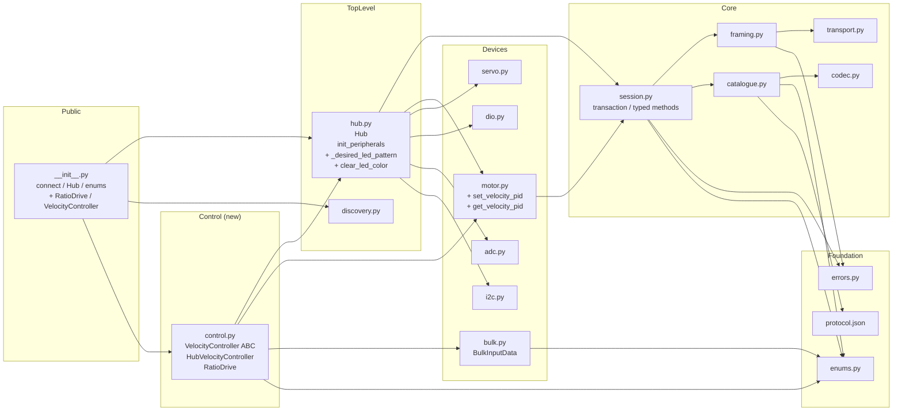
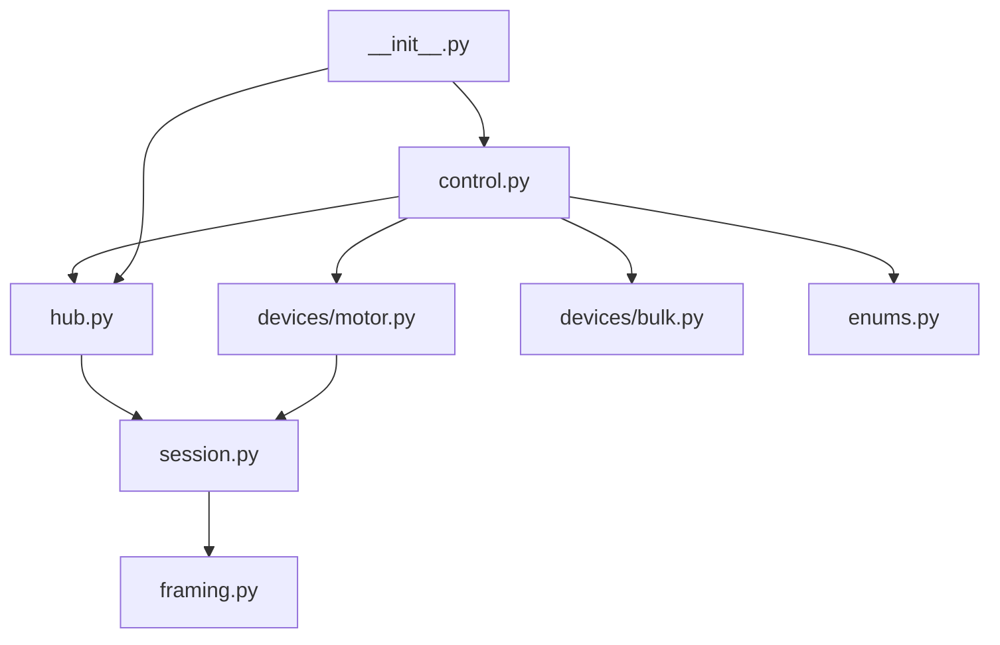

<!-- CLASI: Before changing code or making plans, review the SE process in CLAUDE.md -->

# Architecture Update -- Sprint 002: Hub-managed LED + two-layer motor velocity control

## What Changed

### New module: `src/rhsp/control.py`

Introduces the entire host-side velocity control layer.

| Class | Role |
|-------|------|
| `VelocityController` | Abstract base class (seam): `attach()`, `command(target_counts_s)`, `measured(bulk) -> int`, `detach(disable=True)`, `available: bool` |
| `HubVelocityController` | Concrete implementation wrapping the hub's onboard `CONSTANT_VELOCITY` PID. One instance per motor channel. |
| `RatioDrive` | Public coordinator: daemon loop thread, cap-to-slowest governor, slew limiting, thread-safe setpoint API. |

### Modified: `src/rhsp/hub.py`

- Added `_desired_led_pattern: list[tuple] | None` attribute, initialised to `None` in `__init__`.
- `set_led_color(r, g, b)` now stores the pattern on `self._desired_led_pattern` in addition to sending it immediately.
- `init_peripherals()` calls `GetModuleStatus(clear=True)` early in the bring-up sequence to drain the latched `KeepAliveTimeout | FailSafe` flags before any LED command.
- Keep-alive loop (`_loop` inside `start_keepalive`) extended: after sending `keep_alive()`, if `_desired_led_pattern is not None`, read module status; if no non-routine fault flags, re-assert the pattern; if a real fault flag is present, surface it (raise to `on_error` or log).
- Added `hub.clear_led_color() -> None`: sets `_desired_led_pattern = None`, sending the firmware-default pattern (all-off or vendor default).

### Modified: `src/rhsp/devices/motor.py`

- Added `motor.set_velocity_pid(p: float, i: float, d: float) -> None`: thin wrapper over `session.set_motor_pid_coefficients(address, channel, ClosedLoopMode.VELOCITY, p, i, d)`.
- Added `motor.get_velocity_pid() -> tuple[float, float, float]`: thin wrapper over `session.get_motor_pid_coefficients(address, channel, ClosedLoopMode.VELOCITY)`.

### Modified: `src/rhsp/__init__.py`

- Adds `RatioDrive` and `VelocityController` to imports and `__all__`.

### New test files

- `tests/test_control.py` — hardware-free unit tests for `VelocityController`, `HubVelocityController`, and `RatioDrive` using `FakeHub` + synthetic `BulkInputData`.
- LED heartbeat tests extended in existing `tests/test_session.py` or a new `tests/test_hub_led.py`.

### New example

- `examples/test_ratio_drive.py` — live-hub validation script with capability probe; auto-skips when no hub found.

---

## Why

**LED**: The one-shot LED model forces users to implement their own re-assert loop. On firmware 1.8.2, the hub re-latches `KeepAliveTimeout` after any lapse and reverts the LED to blinking blue. The fix mirrors the FTC SDK's `resendCurrentPattern()` pattern. The status-clear-on-connect fix removes the blinking-blue window that occurs on every fresh connection.

**Motor velocity**: The hub's onboard `CONSTANT_VELOCITY` PID is the standard, validated mode on this firmware. Building a host-side coordinator on top of it lets the library offer coordinated multi-wheel control without reimplementing velocity PID math. The cap-to-slowest governor with slew limiting gives exact ratio preservation with no tuning knobs.

---

## Module Architecture

### Updated Component Diagram



### Dependency Graph (abbreviated to show new edges)



No cycles are introduced. `control.py` sits above `hub.py` and devices in the dependency order, consistent with the existing layering:

```
[control.py] → [hub.py / devices/*] → [session.py] → [framing / transport / codec]
```

---

## Module Boundaries and Responsibilities

### `control.py` (new)

**Responsibility**: Host-side velocity coordination — the only module that runs a background control loop and applies the ratio governor.

**Boundary**: Imports `Hub`, `Motor`, `BulkInputData`, and enum types only. Does not import `Session`, `framing`, `codec`, or `transport`. Does not modify hub state except through `Motor` and `Hub` public API.

**Use cases**: SUC-004, SUC-005.

**Cohesion test**: "Provides host-side multi-wheel velocity coordination using the hub's onboard PID." — one concern, passes.

### `hub.py` (extended)

**Responsibility**: Represents a single connected hub, owns peripheral device lists, manages the keep-alive heartbeat, and now manages the desired LED pattern.

**Extended boundary**: LED pattern state lives on `Hub` because the keep-alive loop already runs in the hub's background thread. No new external dependency is added.

**Use cases**: SUC-001, SUC-002, SUC-003.

### `devices/motor.py` (extended)

**Responsibility**: Thin typed wrapper for motor commands. The two new methods (`set_velocity_pid`, `get_velocity_pid`) are thin delegations to `session.set_motor_pid_coefficients` — same pattern as existing methods.

**Use cases**: SUC-004, SUC-005.

---

## Design Rationale

### Decision 1: LED pattern stored on Hub, re-asserted in the existing heartbeat thread

**Context**: The keep-alive thread is already running and firing every 2 s. Re-asserting the LED in the same thread avoids adding a second background thread, a second lock, or any new timing complexity.

**Alternatives considered**:
- Separate LED-management thread: adds complexity and a second concurrent writer to the session RLock queue.
- User must call `set_led_color()` from their own loop: current state — requires caller discipline.
- Store pattern in `Session`: couples LED state to the protocol layer; not appropriate.

**Why this choice**: The heartbeat thread is the natural place. A single `_desired_led_pattern` attribute on `Hub` is safe with the GIL for a single-writer (caller thread) / single-reader (heartbeat thread) reference swap. The pattern is a short immutable list; no partial-read risk.

**Consequences**: `Hub._desired_led_pattern` becomes a documented semi-private attribute. Clear-back is via `hub.clear_led_color()`. The heartbeat loop grows slightly in body but remains simple.

### Decision 2: VelocityController ABC as a seam, only HubVelocityController built now

**Context**: The stakeholder approved keeping the inner loop a thin seam so a future host-side PID fallback could drop in without changing `RatioDrive`. However, the hub's `CONSTANT_VELOCITY` mode works on fw 1.8.2 and is the only implementation needed now.

**Alternatives considered**:
- Inline hub-PID calls directly in `RatioDrive`: no seam, harder to swap later.
- Build both HubVelocityController and HostPIDController now: speculative generality.

**Why this choice**: The ABC is four methods; it costs almost nothing and preserves the future option. `HubVelocityController` is the only concrete class. The `available` property enables a runtime capability probe in the live example.

**Consequences**: `VelocityController` is exported as part of the public API so advanced users can provide alternative inner loops.

### Decision 3: Governor moves a single float scale `g`, not per-wheel multipliers

**Context**: The ratio invariant `t_i = g * w_i` is exact by construction when all weights are scaled by the same `g`. Per-wheel adjustment would require solving a system of inequalities and could break the ratio.

**Alternatives considered**:
- Per-wheel PID on the ratio error: tuning required, not deterministic.
- Fixed-ratio scaling with separate speed limits per wheel: complex API, harder to reason about.

**Why this choice**: A single `g` variable is the simplest possible implementation that provides the exact ratio guarantee. The slew limit is applied once to `g`, not per wheel.

**Consequences**: The governor cannot boost a lagging wheel — only slow down the faster ones. This is the stated requirement. `min_scale` and `deadband` handle the zero-crossing and noise edge cases.

### Decision 4: `control.py` is a separate module, not embedded in `hub.py`

**Context**: `Hub` is already a device container plus heartbeat manager. Adding a multi-wheel coordinator would make it a god object.

**Alternatives considered**:
- `hub.start_ratio_drive(weights)`: convenience method that instantiates `RatioDrive` internally.
- Embed `RatioDrive` logic in `Hub._loop`: mixes concerns.

**Why this choice**: `control.py` as a separate module passes the cohesion test; `Hub` continues to pass its own. `RatioDrive` depends on `Hub`, not the reverse.

**Consequences**: Users compose `RatioDrive(hub, ...)` explicitly, which is idiomatic and mirrors how `Hub` composes `Motor` objects.

---

## Open Questions

1. **Fault surfacing strategy in the LED heartbeat**: When a real fault flag is detected during re-assert (e.g., over-temp), should the heartbeat (a) call an optional `on_error` callback, (b) log a warning and continue, or (c) raise into the thread (which would kill it)? The issue says "surface real faults rather than swallowing them" but does not specify the mechanism. Proposed default: log a warning at `WARNING` level and continue (keeps the thread alive); provide `on_error` callback hook for structured handling. **Stakeholder input welcome before implementation.**

2. **`init_peripherals()` status clear timing**: The status clear should happen early in `init_peripherals()` — before motor/servo setup commands — so the hub is in a clean state for subsequent LED commands. Confirm that clearing status before sending motor-init commands has no negative side effects on firmware 1.8.2.

3. **`get_motor_pid_coefficients` session method**: The `session.py` typed method for reading back velocity PID coefficients needs to exist for `motor.get_velocity_pid()` to delegate to. If it is not yet implemented in `session.py`, ticket 002 must add it. This needs a quick grep before execution.

---

## Impact on Existing Components

- **`hub.py`**: Extended; no existing public API removed or changed. `set_led_color()` gains a side effect (stores pattern), which is additive. `init_peripherals()` gains an early `GetModuleStatus(clear=True)` call.
- **`devices/motor.py`**: Two new methods added; no existing methods changed.
- **`session.py`**: No changes unless `get_motor_pid_coefficients` is missing (see Open Question 3).
- **`tests/test_session.py`** / **`tests/test_devices.py`**: Existing tests unaffected. New LED-heartbeat tests and motor PID tests are additive.
- **`__init__.py`**: Two new exports added to `__all__`; fully additive.

---

## Migration Concerns

None. All changes are additive. No existing public API is removed or changed. `hub.set_led_color()` gains a side effect (storing the pattern) that is transparent to existing callers — they still get the immediate one-shot behaviour; they now also get automatic re-assertion as a bonus.
