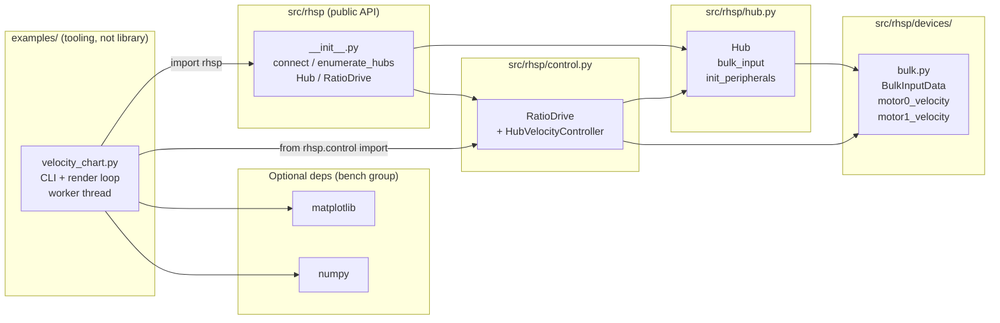
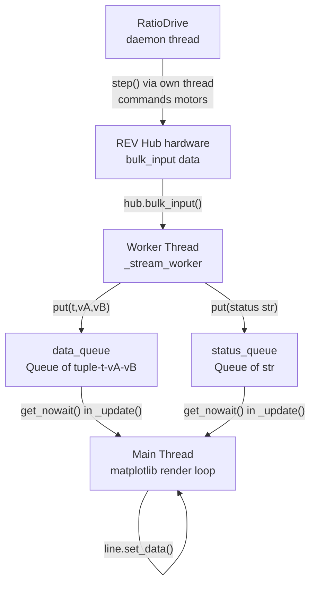

<!-- CLASI: Before changing code or making plans, review the SE process in CLAUDE.md -->

# Architecture Update -- Sprint 003: velocity_chart bench tool

## What Changed

### New file: `examples/velocity_chart.py`

An interactive bench tool in the `examples/` directory (no `test_` prefix so
pytest does not collect it). It consumes the public RHSP API and adds no new
library modules.

**Responsibilities**:
- Render three matplotlib panels: strip chart (motor A velocity vs. time), strip
  chart (motor B velocity vs. time), and phase plot (motor-A velocity vs. motor-B
  velocity).
- Accept CLI arguments: `--port`, `--channels`, `--ratio`, `--speed`, `--window`,
  `--vmax`, `--rate`.
- Manage a single daemon worker thread per SPACE-start that opens a fresh hub
  connection, starts `RatioDrive`, and polls `hub.bulk_input()` at the configured
  rate.
- Push `(t, vA, vB)` tuples to a `data_queue` and status strings to a
  `status_queue` for consumption on the main thread.
- Run the matplotlib render loop (~30 fps) on the main thread: drain queues,
  update line artists, draw.
- Handle SPACE (toggle worker) and Q (quit, clean shutdown) via
  `fig.canvas.mpl_connect("key_press_event", ...)`.
- Select the macOS (`MacOSX`) or Linux (`TkAgg`) backend before importing
  `matplotlib.pyplot`.

**Key design choices**:
- Measured velocities come directly from `hub.bulk_input()` in the worker thread
  — not from `RatioDrive`'s internal state — so the chart is ground-truth telemetry.
- `RatioDrive` is used only to drive the motors; it is the single isolated
  integration point.
- Fresh-connection-per-SPACE (matching the reference pattern) makes the tool
  resilient to hub reboots and encoder wedge states.
- The `RatioDrive` context manager (`with RatioDrive(...) as drive:`) guarantees
  motors are zeroed and disabled on any exit path (normal, exception, or
  SPACE-stop).

### Modified: `pyproject.toml`

Adds an optional dependency group:

```toml
[project.optional-dependencies]
bench = ["matplotlib>=3.8", "numpy>=1.26"]
```

This keeps the core library dependency (`pyserial` only) unchanged. The bench
tool is run via `uv run --extra bench python examples/velocity_chart.py`.

---

## Why

**`velocity_chart.py`**: After Sprint 002 landed `RatioDrive`, there is no
interactive way to observe whether the governor actually holds the velocity ratio
under load, or whether the firmware PID converges cleanly to setpoint. A
live-chart bench tool is the standard validation instrument for control loops:
it makes convergence and saturation behavior immediately visible without writing
one-off scripts.

**`bench` optional dependency group**: matplotlib and numpy are large and not
needed for the core library or its test suite. Placing them in an optional group
keeps `uv run pytest` fast and avoids bloating installs for library consumers.
Using `[project.optional-dependencies]` (PEP 508) is the idiomatic uv/pip
pattern and integrates with `uv run --extra`.

---

## Module Architecture

### Component Diagram



Key: `velocity_chart.py` sits entirely outside the library boundary. It imports
the public API. The library is not modified; only `pyproject.toml` gains the
optional group.

### Data Flow Diagram



Note: the worker thread calls `hub.bulk_input()` for telemetry; `RatioDrive`'s
daemon thread also calls `hub.bulk_input()` internally via `step()`. Both are
safe because `Session` is RLock-guarded — concurrent callers serialize on the
lock without deadlock.

---

## Module Boundaries and Responsibilities

### `examples/velocity_chart.py` (new)

**Responsibility**: Interactive live-telemetry visualization for two-motor
velocity control validation.

**Boundary**: Imports `rhsp` (public API), `rhsp.control.RatioDrive`, `matplotlib`,
`numpy`, and stdlib only. Does not import from `rhsp.session`, `rhsp.framing`,
`rhsp.transport`, or any internal module. Does not modify any file in `src/rhsp/`.

**Use cases**: SUC-001, SUC-002, SUC-003.

**Cohesion test**: "Renders live motor velocity telemetry in a matplotlib window
and drives motors via RatioDrive." — one concern (bench visualization), passes.

### `pyproject.toml` (modified)

**Responsibility**: Declares the project's dependency metadata.

**Change**: One new `[project.optional-dependencies]` table entry (`bench`). No
existing entries removed or changed.

**Use cases**: SUC-001.

---

## Design Rationale

### Decision 1: Read measured velocities from hub.bulk_input(), not from RatioDrive

**Context**: `RatioDrive` exposes a `measured` property (dict of channel →
int) that returns the last values it read internally. The chart could read from
there instead of calling `hub.bulk_input()` again.

**Alternatives considered**:
- Read `drive.measured` from the worker thread: avoids an extra `bulk_input()`
  call per poll tick.
- Read `hub.bulk_input()` directly in the worker: ground-truth hardware read,
  decoupled from RatioDrive internals.

**Why this choice**: `hub.bulk_input()` is the authoritative source; it is what
the hardware actually reports. `drive.measured` lags by one governor step and
could be stale if the governor thread has not ticked yet. Decoupling the chart
from `RatioDrive`'s internal state also means the chart continues working if
`RatioDrive` is replaced or refactored. The extra RLock acquisition for a second
`bulk_input()` call is negligible on a 50 Hz poll loop.

**Consequences**: One additional `GetBulkInputData` transaction per poll tick
while the worker is running. The hub firmware handles concurrent session calls
safely via the existing RLock.

### Decision 2: Fresh-connection-per-SPACE (no persistent hub object)

**Context**: The worker could hold a persistent hub connection across
SPACE-stop/start cycles, or it could open and close a fresh connection on each
SPACE-start.

**Alternatives considered**:
- Persistent connection held outside the worker: connection state leaks across
  cycles; harder to recover from hub reboots.
- Fresh connection per SPACE: mirrors the reference script's proven approach;
  hub context manager guarantees clean teardown on exit.

**Why this choice**: Fresh-connection-per-SPACE is already proven correct in the
reference. It makes the tool resilient to hub power cycles and encoder wedge
states without any additional recovery logic. The `with rhsp.connect(port) as hub:`
block handles keep-alive startup and fail-safe shutdown automatically.

**Consequences**: A brief "CONNECTING" pause on each SPACE-start (hub
handshake + `init_peripherals()`). Acceptable for an interactive bench tool.

### Decision 3: matplotlib and numpy as optional dependencies, not dev dependencies

**Context**: matplotlib and numpy could be placed in `[dependency-groups] dev`
(uv-only syntax) alongside pytest, or in `[project.optional-dependencies]`.

**Alternatives considered**:
- `[dependency-groups] dev`: uv-specific, not PEP 508 standard; would bundle
  bench with pytest installs.
- `[project.optional-dependencies] bench`: PEP 508 standard; usable with both
  uv and pip; keeps dev (pytest) separate from bench (matplotlib/numpy).

**Why this choice**: `[project.optional-dependencies]` is the standard mechanism
for extras. It allows `pip install rhsp[bench]` in addition to `uv run --extra bench`,
and keeps the pytest dev environment free of large plotting libraries.

**Consequences**: Pytest installs remain fast. Library consumers who want the
bench tool add `[bench]` to their install.

---

## Open Questions

1. **`--channels` argument format**: The issue specifies `--channels 0,1` as a
   comma-separated string. Confirm whether argparse should parse this as a
   `str` (split in code) or as two separate `--channel-a`/`--channel-b`
   arguments. Either works; comma-separated matches the reference's style.

2. **Phase plot axis labels**: The issue specifies units "counts/s" with motor A
   on the X axis and motor B on the Y axis. Confirm that "motor A" is always
   `channels[0]` and "motor B" is always `channels[1]` (i.e., the first
   channel is the reference axis).

3. **No-hub startup behavior**: Should the script fail fast with a clear error
   message when `enumerate_hubs()` returns an empty list and `--port` is not
   specified? Or should it open the window anyway and wait for SPACE to discover
   the error? The reference prints an error and returns early; adopting the same
   behavior is recommended.

---

## Impact on Existing Components

- **`src/rhsp/`**: No changes. All library modules are unchanged.
- **`pyproject.toml`**: One new table entry (`[project.optional-dependencies]`)
  added. The `dependencies` list and `[dependency-groups] dev` are unchanged.
- **`tests/`**: No new test files. Existing `uv run pytest` gate is unaffected.
  The new script has no `test_` prefix and `testpaths = ["tests"]` in
  `pytest.ini_options` prevents it from being collected.
- **`examples/`**: One new file added. No existing example scripts are changed.

---

## Migration Concerns

None. All changes are additive. The core library API is unchanged. The `bench`
optional group is opt-in. Existing installs (without `--extra bench`) are
unaffected.
