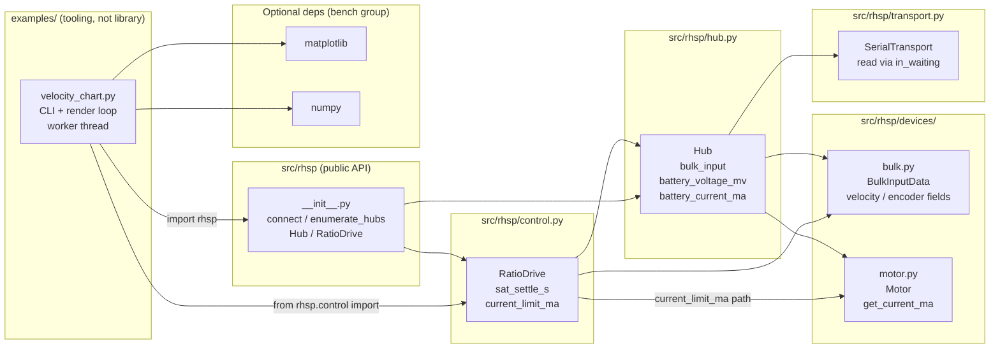
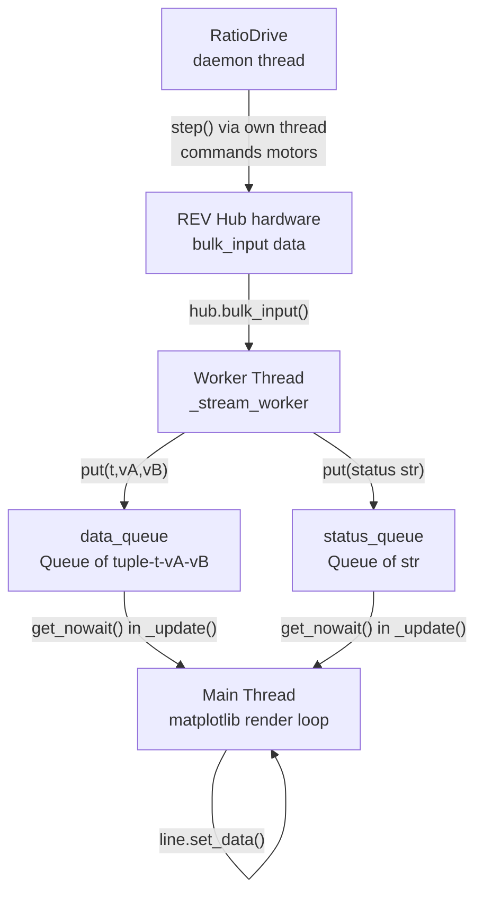

<!-- CLASI: Before changing code or making plans, review the SE process in CLAUDE.md -->

# Architecture Update -- Sprint 003: velocity_chart bench tool

## What Changed

### New file: `examples/velocity_chart.py`

An interactive bench tool in the `examples/` directory (no `test_` prefix so
pytest does not collect it). It consumes the public RHSP API and adds no new
library modules.

**Responsibilities**:
- Render three matplotlib panels: strip chart (motor A velocity vs. time), strip
  chart (motor B velocity vs. time), and phase plot (motor-A velocity vs. motor-B
  velocity).
- Accept CLI arguments: `--port`, `--channels`, `--ratio`, `--speed`, `--window`,
  `--vmax`, `--rate`.
- Manage a single daemon worker thread per SPACE-start that opens a fresh hub
  connection, starts `RatioDrive`, and polls `hub.bulk_input()` at the configured
  rate.
- Push `(t, vA, vB)` tuples to a `data_queue` and status strings to a
  `status_queue` for consumption on the main thread.
- Run the matplotlib render loop (~30 fps) on the main thread: drain queues,
  update line artists, draw.
- Handle SPACE (toggle worker) and Q (quit, clean shutdown) via
  `fig.canvas.mpl_connect("key_press_event", ...)`.
- Select the macOS (`MacOSX`) or Linux (`TkAgg`) backend before importing
  `matplotlib.pyplot`.

**Key design choices**:
- Measured velocities come directly from `hub.bulk_input()` in the worker thread
  — not from `RatioDrive`'s internal state — so the chart is ground-truth telemetry.
- `RatioDrive` is used only to drive the motors; it is the single isolated
  integration point.
- Fresh-connection-per-SPACE (matching the reference pattern) makes the tool
  resilient to hub reboots and encoder wedge states.
- The `RatioDrive` context manager (`with RatioDrive(...) as drive:`) guarantees
  motors are zeroed and disabled on any exit path (normal, exception, or
  SPACE-stop).

### Modified: `pyproject.toml`

Adds an optional dependency group:

```toml
[project.optional-dependencies]
bench = ["matplotlib>=3.8", "numpy>=1.26"]
```

This keeps the core library dependency (`pyserial` only) unchanged. The bench
tool is run via `uv run --extra bench python examples/velocity_chart.py`.

---

### Modified: `src/rhsp/transport.py` (added in execution — ticket 003-004)

Fixed `SerialTransport.read` latency. On macOS, pyserial's `inter_byte_timeout`
does not cause `read(512)` to return early — it blocks for the full 1.0 s port
timeout waiting for 512 bytes that never arrive (~20-byte responses). Every
transaction therefore took ~1 000 ms on real hardware (~1 Hz throughput).

**Fix**: When `in_waiting > 0`, read `min(n, in_waiting)` bytes immediately.
When the buffer is empty, do a single blocking `read(1)` (bounded by the
existing `timeout`) so the first byte wakes the caller without busy-waiting. The
session's existing poll loop drains the remainder on subsequent iterations.
Timeout and retry semantics are unchanged; `LoopbackTransport` (tests) is
unaffected. Measured result: ~16 ms/transaction on fw 1.8.2 (~62× speedup).
Three new hardware-free unit tests added in `tests/test_transport.py`.

### Modified: `src/rhsp/control.py` — governor spin-up fix (ticket 003-005)

Fixed `RatioDrive` governor spin-up collapse. The saturation detector fired on a
single tick: during motor acceleration the measured velocity necessarily lags the
commanded scale, so `shortfall > sat_margin` triggered on the very first tick
after `g` stepped up, capping the scale back to 0 before the motor had time to
reach speed. This caused perpetual oscillation between ~120 and 0 on the real
hub.

**Fix**: Saturation now requires the shortfall to persist continuously for a
`sat_settle_s` window (new constructor parameter, default 0.3 s) before the
scale ceiling is engaged. Per-channel shortfall accumulation is tracked in `dt`
increments; the accumulator resets when shortfall falls below `sat_release_margin`.
All existing public semantics (cap-to-slowest under genuine sustained load, slew
limits, hysteresis) are preserved. Hardware-validated: scale ramps cleanly to
1 000 cnt/s with no collapse; sustained-load cap-to-slowest still triggers correctly.

### Modified: `src/rhsp/control.py` — current-aware de-rating (ticket 003-007)

Added opt-in current-aware de-rating to `RatioDrive`. The fw 1.8.2 onboard
CONSTANT_VELOCITY PID is stiff: under load it holds velocity by ramping motor
current to overcurrent rather than letting velocity droop. Because velocity never
droops, the velocity-saturation governor never triggers, and the bench supply
trips instead. Current-based de-rating is the correct guard for this firmware.

**API change**: `RatioDrive.__init__` gains `current_limit_ma: int | None = None`.
When set, the governor reads each active motor's current every Nth tick (every
3rd tick at 50 Hz → ~16 Hz effective, keeping the keep-alive heartbeat well
within its 100 ms budget). If any motor's current exceeds the limit, `g` is
capped proportionally (`ceiling = g * (limit / current)`) with hysteresis, then
slew-limited — the same machinery as the velocity saturation path. The commanded
ratio between motors is preserved exactly at all times (targets are still
`clamp_int16(round(g * w_i))`). When `current_limit_ma=None` (default),
no current reads occur and all existing behavior is identical.

`examples/velocity_chart.py` gains `--current-limit MA` (default 2000) and
displays per-motor current in the figure title (`I0=NNNmA I1=NNNmA`).

Hardware gate passed 2026-06-06: hand-loading a motor at `--current-limit 1500`
de-rated the pack with the phase dot sliding down the ratio line; supply did not
trip.

### Modified: `src/rhsp/devices/motor.py` and `src/rhsp/hub.py` — ADC API (ticket 003-006)

On fw 1.8.2 the `GetBulkInputData` response is ~34 bytes — it ends after
encoders/velocities/motor modes. The current and voltage monitor fields in
`BulkInputData` (`motorN_current_ma`, `battery_voltage_mv`, etc.) are not
present in the response; the tolerant decode silently returned 0 for all of them.

**Changes**:
- `Motor.get_current_ma() -> int`: reads via `session.get_adc(addr,
  ADCChannel.ADC_Motor0 + channel)`. Returns mA.
- `Hub.battery_voltage_mv() -> int`: reads via `ADCChannel.ADC_BatteryMonitor`
  (ch 13).
- `Hub.battery_current_ma() -> int`: reads via `ADCChannel.ADC_Battery` (ch 7).
- `src/rhsp/devices/bulk.py`: removed `motor*_current_ma`,
  `battery_current_ma`, `battery_voltage_mv`, `mon5v_mv`, `gpio_current_ma`,
  `i2c_current_ma`, `servo_current_ma` from `BulkInputData`. The class now
  documents that fields beyond offset 34 are zero-padded on fw 1.8.2. Direct
  `session.transaction("GetBulkInputData")` is not supported on fw 1.8.2 and is
  documented as such. `hub.bulk_input()` (which zero-pads short payloads) remains
  the only supported path and continues to return correct encoders/velocities/modes.
14 new hardware-free unit tests added.

---

## Why

**`velocity_chart.py`**: After Sprint 002 landed `RatioDrive`, there is no
interactive way to observe whether the governor actually holds the velocity ratio
under load, or whether the firmware PID converges cleanly to setpoint. A
live-chart bench tool is the standard validation instrument for control loops:
it makes convergence and saturation behavior immediately visible without writing
one-off scripts.

**`bench` optional dependency group**: matplotlib and numpy are large and not
needed for the core library or its test suite. Placing them in an optional group
keeps `uv run pytest` fast and avoids bloating installs for library consumers.
Using `[project.optional-dependencies]` (PEP 508) is the idiomatic uv/pip
pattern and integrates with `uv run --extra`.

**Library fixes (003-004 – 003-007)**: Hardware validation revealed three
blocking defects that could not be deferred:
- `SerialTransport.read` latency made every transaction ~1 000 ms on macOS,
  rendering the bench tool unusable at any practical poll rate.
- The `RatioDrive` governor collapsed to 0 on spin-up due to missing settling
  time on the saturation detector, so motors never reached setpoint.
- `GetBulkInputData` current/voltage fields are silently zero on fw 1.8.2; the
  only way to read motor current is `GetADC`.

**Key hardware insight driving the current-aware design**: The fw 1.8.2 onboard
CONSTANT_VELOCITY PID is stiff — under mechanical load it holds velocity by
ramping motor current toward overcurrent rather than letting speed droop. As a
consequence the velocity-based saturation governor is ineffective on this
firmware: the velocity signal never droops enough to trigger the cap, and the
bench supply trips on overcurrent instead. The ratio coordinator must therefore
de-rate on current, not on velocity droop.

---

## Module Architecture

### Component Diagram



Key: `velocity_chart.py` sits entirely outside the library boundary. The library
changes this sprint are all in existing modules — no new modules were added.

### Data Flow Diagram



Note: the worker thread calls `hub.bulk_input()` for telemetry; `RatioDrive`'s
daemon thread also calls `hub.bulk_input()` internally via `step()`. Both are
safe because `Session` is RLock-guarded — concurrent callers serialize on the
lock without deadlock.

---

## Module Boundaries and Responsibilities

### `examples/velocity_chart.py` (new)

**Responsibility**: Interactive live-telemetry visualization for two-motor
velocity control validation.

**Boundary**: Imports `rhsp` (public API), `rhsp.control.RatioDrive`, `matplotlib`,
`numpy`, and stdlib only. Does not import from `rhsp.session`, `rhsp.framing`,
`rhsp.transport`, or any internal module. Does not modify any file in `src/rhsp/`.

**Use cases**: SUC-001, SUC-002, SUC-003.

**Cohesion test**: "Renders live motor velocity telemetry in a matplotlib window
and drives motors via RatioDrive." — one concern (bench visualization), passes.

### `pyproject.toml` (modified)

**Responsibility**: Declares the project's dependency metadata.

**Change**: One new `[project.optional-dependencies]` table entry (`bench`). No
existing entries removed or changed.

**Use cases**: SUC-001.

### `src/rhsp/transport.py` (modified — ticket 003-004)

**Responsibility**: Encapsulates pyserial I/O for the RHSP session layer.

**Change**: `SerialTransport.read(n)` now reads `in_waiting` bytes when data is
available (bounded by `n`), or falls back to a single blocking `read(1)` when
the buffer is empty. No change to the `LoopbackTransport` used in tests.

**Use cases**: SUC-002, SUC-003 (whole-library latency fix; all transaction
throughput depends on this).

### `src/rhsp/control.py` (modified — tickets 003-005, 003-007)

**Responsibility**: Implements `RatioDrive` — the two-motor velocity ratio
coordinator and governor.

**Changes**:
- `RatioDrive.__init__` gains `sat_settle_s: float = 0.3` — settling window
  before the saturation detector caps the scale.
- `RatioDrive.__init__` gains `current_limit_ma: int | None = None` — opt-in
  current-aware de-rating; when set, reads per-motor current every Nth tick and
  caps `g` proportionally when the limit is exceeded.

**Use cases**: SUC-002, SUC-003.

### `src/rhsp/devices/motor.py` (modified — ticket 003-006)

**Responsibility**: Represents a single hub motor channel.

**Change**: Adds `Motor.get_current_ma() -> int` via
`session.get_adc(addr, ADCChannel.ADC_Motor0 + channel)`.

**Use cases**: SUC-002, SUC-003.

### `src/rhsp/hub.py` (modified — ticket 003-006)

**Responsibility**: High-level hub facade.

**Changes**: Adds `Hub.battery_voltage_mv() -> int` (via `ADC_BatteryMonitor`)
and `Hub.battery_current_ma() -> int` (via `ADC_Battery`).

**Use cases**: SUC-002, SUC-003.

### `src/rhsp/devices/bulk.py` (modified — ticket 003-006)

**Responsibility**: Decodes the `GetBulkInputData` response payload.

**Change**: Removed current/voltage fields (`motor*_current_ma`,
`battery_current_ma`, `battery_voltage_mv`, `mon5v_mv`, `gpio_current_ma`,
`i2c_current_ma`, `servo_current_ma`) that fw 1.8.2 never populates. The class
now documents that the 34-byte fw 1.8.2 response ends after encoder/velocity/mode
fields and that the removed fields must be read via `GetADC`.

**Use cases**: SUC-002, SUC-003.

---

## Design Rationale

### Decision 1: Read measured velocities from hub.bulk_input(), not from RatioDrive

**Context**: `RatioDrive` exposes a `measured` property (dict of channel →
int) that returns the last values it read internally. The chart could read from
there instead of calling `hub.bulk_input()` again.

**Alternatives considered**:
- Read `drive.measured` from the worker thread: avoids an extra `bulk_input()`
  call per poll tick.
- Read `hub.bulk_input()` directly in the worker: ground-truth hardware read,
  decoupled from RatioDrive internals.

**Why this choice**: `hub.bulk_input()` is the authoritative source; it is what
the hardware actually reports. `drive.measured` lags by one governor step and
could be stale if the governor thread has not ticked yet. Decoupling the chart
from `RatioDrive`'s internal state also means the chart continues working if
`RatioDrive` is replaced or refactored. The extra RLock acquisition for a second
`bulk_input()` call is negligible on a 50 Hz poll loop.

**Consequences**: One additional `GetBulkInputData` transaction per poll tick
while the worker is running. The hub firmware handles concurrent session calls
safely via the existing RLock.

### Decision 2: Fresh-connection-per-SPACE (no persistent hub object)

**Context**: The worker could hold a persistent hub connection across
SPACE-stop/start cycles, or it could open and close a fresh connection on each
SPACE-start.

**Alternatives considered**:
- Persistent connection held outside the worker: connection state leaks across
  cycles; harder to recover from hub reboots.
- Fresh connection per SPACE: mirrors the reference script's proven approach;
  hub context manager guarantees clean teardown on exit.

**Why this choice**: Fresh-connection-per-SPACE is already proven correct in the
reference. It makes the tool resilient to hub power cycles and encoder wedge
states without any additional recovery logic. The `with rhsp.connect(port) as hub:`
block handles keep-alive startup and fail-safe shutdown automatically.

**Consequences**: A brief "CONNECTING" pause on each SPACE-start (hub
handshake + `init_peripherals()`). Acceptable for an interactive bench tool.

### Decision 3: matplotlib and numpy as optional dependencies, not dev dependencies

**Context**: matplotlib and numpy could be placed in `[dependency-groups] dev`
(uv-only syntax) alongside pytest, or in `[project.optional-dependencies]`.

**Alternatives considered**:
- `[dependency-groups] dev`: uv-specific, not PEP 508 standard; would bundle
  bench with pytest installs.
- `[project.optional-dependencies] bench`: PEP 508 standard; usable with both
  uv and pip; keeps dev (pytest) separate from bench (matplotlib/numpy).

**Why this choice**: `[project.optional-dependencies]` is the standard mechanism
for extras. It allows `pip install rhsp[bench]` in addition to `uv run --extra bench`,
and keeps the pytest dev environment free of large plotting libraries.

**Consequences**: Pytest installs remain fast. Library consumers who want the
bench tool add `[bench]` to their install.

---

## Open Questions

*All planning-time open questions were resolved during execution:*

1. **`--channels` argument format** — resolved: implemented as comma-separated
   string (`--channels 0,1`), split in code.

2. **Phase plot axis labels** — resolved: motor A is `channels[0]` (X axis),
   motor B is `channels[1]` (Y axis).

3. **No-hub startup behavior** — resolved: stakeholder approved fail-fast
   (no hub + no `--port` → print error + exit 2). The original acceptance
   criterion describing an always-open matplotlib window was superseded by this
   decision (see ticket 003-003).

---

## Impact on Existing Components

- **`src/rhsp/transport.py`**: `SerialTransport.read` behavior changed. On
  macOS (and any platform where `inter_byte_timeout` does not short-circuit
  `read(n)`), the call now returns as soon as data is available rather than
  blocking for the full port timeout. The `LoopbackTransport` used in tests is
  unaffected. Timeout semantics are preserved.
- **`src/rhsp/control.py`**: `RatioDrive` constructor gains two new optional
  parameters (`sat_settle_s`, `current_limit_ma`). Callers that pass no
  arguments are unaffected. Saturation timing changes: with the default
  `sat_settle_s=0.3`, a shortfall must persist for 0.3 s before the scale is
  capped; callers relying on single-tick saturation (which was always a bug)
  need no update.
- **`src/rhsp/devices/motor.py`**: Gains `get_current_ma()`. No existing methods
  changed.
- **`src/rhsp/hub.py`**: Gains `battery_voltage_mv()` and `battery_current_ma()`.
  No existing methods changed.
- **`src/rhsp/devices/bulk.py`**: Breaking change — current/voltage fields
  removed from `BulkInputData`. Callers that accessed `motor*_current_ma`,
  `battery_voltage_mv`, `battery_current_ma`, `mon5v_mv`, `gpio_current_ma`,
  `i2c_current_ma`, or `servo_current_ma` must migrate to `Motor.get_current_ma()`
  and `Hub.battery_voltage_mv()` / `Hub.battery_current_ma()` respectively.
- **`pyproject.toml`**: One new table entry (`[project.optional-dependencies]`)
  added. The `dependencies` list and `[dependency-groups] dev` are unchanged.
- **`tests/`**: 574 passing at sprint close (was the sprint baseline before
  tickets 003-004 through 003-007). New tests added in `tests/test_transport.py`
  (3), `tests/test_control.py` (spin-up and current-limit coverage), and
  `tests/test_devices.py` / `tests/test_hub.py` (14 for the ADC API). The bench
  script has no `test_` prefix and `testpaths = ["tests"]` prevents collection.
- **`examples/`**: `velocity_chart.py` gained `--current-limit` and per-motor
  current display. No other example scripts changed.

---

## Migration Concerns

**`BulkInputData` field removal (breaking)**: The current/voltage fields removed
from `BulkInputData` were silently returning 0 on fw 1.8.2 — they were never
populated. Any code reading those fields was already getting incorrect data.
Migration path: use `Motor.get_current_ma()` for per-motor current and
`Hub.battery_voltage_mv()` / `Hub.battery_current_ma()` for hub-level power
readings.

All other changes are additive or behavior-preserving:
- `SerialTransport.read` is a latency fix with no API change.
- `RatioDrive` new constructor parameters are optional with backward-compatible
  defaults.
- `Motor.get_current_ma()`, `Hub.battery_voltage_mv()`, and
  `Hub.battery_current_ma()` are new methods; no existing method signatures
  changed.
- The `bench` optional group is opt-in. Existing installs (without
  `--extra bench`) are unaffected.
